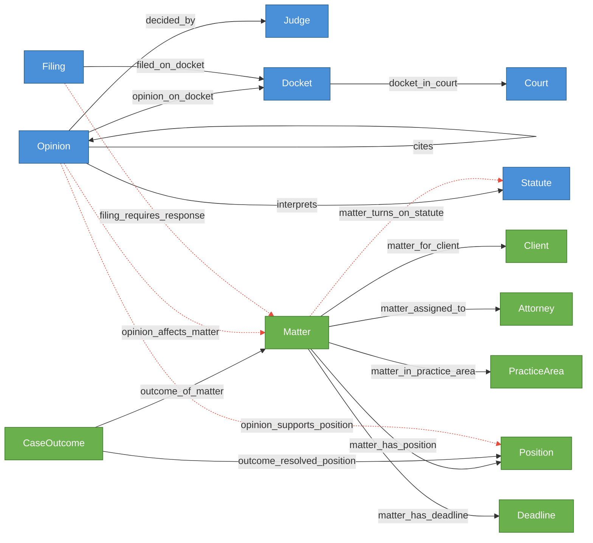

# Case Law Monitoring

Planned forkable legal world model for CourtListener-driven opinion impact review and filing triage.

This README captures the intended Cruxible shape for the demo. It mirrors the KEV triage split between a public reference layer and a customer fork, but the executable configs and sample data are not checked in yet.

## Structure

This demo is planned as two configs that represent the two layers:

- **`courtlistener-reference.yaml`** — the published upstream world model. Contains only public entity types (`Court`, `Judge`, `Docket`, `Opinion`, `Filing`, `Statute`), deterministic reference relationships, plus a canonical workflow that builds accepted reference state from a bundled CourtListener artifact. This is what Cruxible hosts and keeps updated from public feeds. Read-only to forks.

- **`config.yaml`** — a customer fork that uses `extends: courtlistener-reference.yaml`. Adds internal entity types (`Matter`, `Client`, `Attorney`, `PracticeArea`, `Position`, `Deadline`, `CaseOutcome`), deterministic internal mappings, governed judgment relationships, feedback and outcome profiles, and named queries that traverse across both layers.

## Schema Diagram

Entity types and relationships, color-coded by layer. Dashed lines are governed relationships that go through the proposal/group resolution flow.



**Legend:** Blue = reference layer (upstream, read-only) | Green = fork (internal) | Solid lines = deterministic | Dashed red lines = governed (proposal/review)

## Case Outcomes and the Compounding Loop

A firm's fork accumulates institutional knowledge through two complementary mechanisms:

1. **Deterministic case-result facts** — `CaseOutcome` entities record what actually happened: won, lost, settled, dismissed. The `outcome_resolved_position` edge links each outcome to the specific legal positions that were argued, with properties capturing whether the position prevailed, its role in the outcome, and the weight the court gave it. These are firm-owned domain facts, loaded via the `record_case_outcomes` canonical workflow.

2. **Loop 2 calibration records** — Cruxible's platform outcome system records whether prior governed decisions were correct. When a resolution on `opinion_affects_matter` turns out to be wrong (the opinion didn't actually matter), the Loop 2 outcome codes (`overstated_impact`, `missed_material_opinion`) feed into `analyze_outcomes`, which proposes operational improvements.

These are different things solving different problems. `CaseOutcome` is "what happened in court." Loop 2 outcomes are "was our system's judgment about it correct."

### How the loop compounds

```
Case resolved
  → record_case_outcomes workflow loads CaseOutcome + outcome_resolved_position edges
  → Loop 2 outcome records assess prior governed resolutions
  → analyze_outcomes detects patterns across accumulated case history:

    "Position X loses in Circuit Y"
      → decision policy: require_review for opinion_supports_position in that circuit

    "Integration Z overestimates impact for practice area W"
      → trust adjustment: lower auto-resolve confidence for that integration + context

    "Matters with < 2 statute links produce bad impact assessments"
      → constraint proposal: minimum statute link count before opinion monitoring activates

  → Approved suggestions become constraints, policies, and trust adjustments
  → Next case benefits from tighter rules, better routing, calibrated trust
```

Each resolved matter makes the system's governed judgments more precise — not because the graph is bigger, but because Loop 2 converts outcome patterns into operational rules that change how future proposals are evaluated. A firm with 500 resolved matters has a fundamentally different (and better-calibrated) proposal resolution pipeline than one with 10.

### What the fork accumulates over time

The upstream reference world provides the raw legal universe. The fork's compounding value is:

- **The firm's caseload** — matters, clients, positions, deadlines as structured graph state
- **Case outcome history** — which positions prevailed, in which courts, before which judges, with what authority chains
- **Judgment calibration** — constraints, decision policies, and trust profiles derived from Loop 2 analysis of accumulated outcomes
- **Jurisdictional expertise** — implicit in the pattern of approved `opinion_affects_matter` edges: which courts and judges produce opinions that matter to this firm's practice

None of this exists in the upstream reference world. The reference world is "here are the courts, opinions, statutes, and filings." The fork is "here is how our firm interprets and acts on that information, with receipts."

## Governed Relationships

Each governed relationship has a `matching` block, integrations that provide signals, and linked feedback/outcome profiles for the Loop 1/2 flywheel.

| Relationship | Integrations | Roles | Auto-resolve | Feedback Profile | Outcome Profile |
|---|---|---|---|---|---|
| `matter_turns_on_statute` | `matter_statute_match` | required | all_support | `matter_turns_on_statute` | `matter_turns_on_statute_resolution` |
| `opinion_affects_matter` | `opinion_matter_impact`, `jurisdiction_overlap` | required, advisory | all_support | `opinion_affects_matter` | `opinion_affects_matter_resolution` |
| `opinion_supports_position` | `position_authority_review` | required | all_support | `opinion_supports_position` | `opinion_supports_position_resolution` |
| `filing_requires_response` | `filing_obligation_review`, `docket_matter_match` | required, required | all_support | `filing_requires_response` | `filing_requires_response_resolution` |

### Integration signals

| Integration | Kind | Notes |
|---|---|---|
| `matter_statute_match` | matter_issue_scope_match | Link tracked matters to statutes or doctrines referenced in pleadings and briefs |
| `opinion_matter_impact` | opinion_impact_assessment | Assess whether a new opinion materially affects a tracked matter |
| `jurisdiction_overlap` | authority_weighting | Weight whether the opinion is binding, persuasive, or irrelevant in the target matter |
| `position_authority_review` | position_authority_assessment | Determine whether the opinion supports, distinguishes, or weakens a tracked legal position |
| `filing_obligation_review` | filing_obligation_assessment | Determine whether a filing creates a response obligation or deadline |
| `docket_matter_match` | docket_matter_resolution | Match an external docket event to the correct tracked matter |

## Rules Summary

### Constraints

Initial constraints are seeded from practice group policy. Additional constraints are proposed from Loop 2 outcome analysis as case history accumulates.

### Planned quality checks

| Name | Kind | Target | Severity | What it checks |
|---|---|---|---|---|
| `matters_have_one_client` | cardinality | Matter -> matter_for_client (out) | warning | Every tracked matter has exactly one client |
| `matters_have_one_attorney` | cardinality | Matter -> matter_assigned_to (out) | warning | Every tracked matter has a primary assigned attorney |
| `opinions_have_citation` | property | Opinion.citation non_empty | warning | No blank citations in reference opinions |
| `filings_have_docket` | cardinality | Filing -> filed_on_docket (out) | error | Every filing is attached to exactly one docket |
| `deadlines_have_matter` | cardinality | Matter -> matter_has_deadline (out) | warning | Deadlines are anchored to tracked matters |
| `outcomes_have_matter` | cardinality | CaseOutcome -> outcome_of_matter (out) | error | Every case outcome is linked to a matter |
| `outcomes_have_position` | cardinality | CaseOutcome -> outcome_resolved_position (out) | warning | Case outcomes should record which positions were argued |

## Feedback Profiles (Loop 1)

Structured reason codes agents attach to feedback, enabling `analyze_feedback` to produce constraint, decision policy, quality check, or provider-fix suggestions.

| Profile | Reason Codes | Scope Keys |
|---|---|---|
| `matter_turns_on_statute` | `wrong_statute_link` (provider_fix), `issue_not_in_case` (quality_check), `duplicate_scope` (constraint) | matter, statute, practice_area |
| `opinion_affects_matter` | `non_material_authority` (decision_policy), `jurisdiction_mismatch` (constraint), `holding_misread` (provider_fix) | opinion, matter, court |
| `opinion_supports_position` | `actually_adverse` (provider_fix), `distinguished_on_facts` (decision_policy), `position_outdated` (quality_check) | position, matter, opinion |
| `filing_requires_response` | `no_response_required` (constraint), `deadline_extraction_error` (provider_fix), `wrong_matter_routing` (quality_check) | docket, filing_type, matter |

Remediation hints in parentheses tell `analyze_feedback` what kind of suggestion to produce.

## Outcome Profiles (Loop 2)

Structured outcome codes for trust calibration (resolution-anchored) and query/workflow assessment (receipt-anchored).

### Resolution-anchored (was this proposal resolution correct?)

| Profile | Relationship | Outcome Codes |
|---|---|---|
| `matter_turns_on_statute_resolution` | `matter_turns_on_statute` | `wrong_statute_scope` (trust_adjustment), `missed_core_statute` (require_review) |
| `opinion_affects_matter_resolution` | `opinion_affects_matter` | `overstated_impact` (trust_adjustment), `missed_material_opinion` (require_review), `jurisdiction_weight_error` (provider_fix) |
| `opinion_supports_position_resolution` | `opinion_supports_position` | `supporting_authority_was_adverse` (trust_adjustment), `persuasive_only` (require_review) |
| `filing_requires_response_resolution` | `filing_requires_response` | `false_deadline` (trust_adjustment), `missed_deadline` (require_review), `calendar_parse_error` (provider_fix) |

### Receipt-anchored (did this query or workflow give a good answer?)

| Profile | Surface | Outcome Codes |
|---|---|---|
| `impacted_matters_query` | query: `impacted_matters` | `missing_results` (graph_fix), `overstated_impact` (workflow_fix) |
| `deadline_watch_query` | query: `deadline_watch` | `missed_deadline` (workflow_fix), `stale_deadline` (graph_fix) |
| `opinion_impact_review_workflow` | workflow: `propose_opinion_impact` | `missed_authority` (workflow_fix), `bad_case_routing` (provider_fix) |
| `position_track_record_query` | query: `position_track_record` | `authority_chain_incomplete` (graph_fix), `winning_pattern_not_reused` (workflow_fix) |

## Named Queries

Cross-layer traversals that start from one entity type and follow relationships across the reference and fork layers.

| Query | Entry Point | Returns | Traversal |
|---|---|---|---|
| `impacted_matters` | Opinion | Matter | `-> opinion_affects_matter` |
| `matter_authority_chain` | Matter | Opinion | `-> matter_turns_on_statute <- interprets <- cites` |
| `judge_opinion_history` | Judge | Opinion | `<- decided_by` |
| `circuit_split_watch` | Statute | Opinion | `<- interprets -> opinion_on_docket -> docket_in_court` |
| `client_impact_watch` | Client | Opinion | `<- matter_for_client <- opinion_affects_matter` |
| `deadline_watch` | Attorney | Deadline | `<- matter_assigned_to -> matter_has_deadline` |
| `position_track_record` | Position | CaseOutcome | `<- outcome_resolved_position` |

## Workflows

The reference world defines one canonical build workflow. The fork defines two canonical seed-load workflows and four non-canonical proposal workflows.

| Workflow | Canonical | Layer | Purpose |
|---|---|---|---|
| `build_public_courtlistener_reference` | yes | reference | Load courts, judges, dockets, opinions, filings, statutes, and deterministic reference edges from a bundled CourtListener artifact |
| `build_firm_case_state` | yes | fork | Load deterministic entities (`Matter`, `Client`, `Attorney`, `PracticeArea`, `Position`, `Deadline`) and internal edges from seed data |
| `record_case_outcomes` | yes | fork | Load resolved `CaseOutcome` entities and `outcome_of_matter` / `outcome_resolved_position` edges from case-management exports |
| `propose_matter_statutes` | no | fork | Extract or normalize statutory/doctrinal scope for tracked matters and propose governed `matter_turns_on_statute` edges |
| `propose_opinion_impact` | no | fork | Compare new opinions against approved matter-statute links and jurisdictions, then propose `opinion_affects_matter` edges |
| `propose_position_authority` | no | fork | Assess whether a new opinion supports, distinguishes, or weakens a tracked argument, then propose `opinion_supports_position` edges |
| `propose_filing_response` | no | fork | Classify new filings, extract deadlines and obligations, route to the correct matter, and propose `filing_requires_response` edges |

### `outcome_resolved_position` edge properties

| Property | Type | Description |
|---|---|---|
| `role` | string | How the position was used: `primary_argument`, `alternative_argument`, `defensive`, `amicus` |
| `prevailed` | boolean | Whether the position was accepted by the court |
| `weight` | string | Court's treatment: `adopted`, `distinguished`, `rejected`, `not_reached` |
| `notes` | string | Free-text annotation from the reviewing attorney |

### Providers

| Provider | Input | Output | Artifact | Purpose |
|---|---|---|---|---|
| `load_public_courtlistener_rows` | `EmptyInput` | `CourtListenerRows` | `public_courtlistener_bundle` | Load normalized CourtListener opinions, filings, dockets, judges, courts, and statutes |
| `load_firm_seed_data` | `EmptyInput` | `FirmCaseSeedData` | `firm_case_bundle` | Load matters, clients, attorneys, practice areas, positions, and deadlines from seed data |
| `load_case_outcomes` | `EmptyInput` | `CaseOutcomeData` | `case_outcome_bundle` | Load resolved case outcomes and position results from case-management exports |
| `extract_matter_statutes` | `MatterStatuteInput` | `MatterStatuteResults` | — | Extract or normalize statutes and doctrines referenced by tracked matters |
| `assess_opinion_matter_impact` | `OpinionImpactInput` | `OpinionImpactResults` | — | Compare an opinion's holdings to approved matter-statute links and authority weight |
| `assess_position_authority` | `PositionAuthorityInput` | `PositionAuthorityResults` | — | Determine whether an opinion supports, distinguishes, or undermines a tracked position |
| `classify_filing_obligation` | `FilingObligationInput` | `FilingObligationResults` | — | Classify filing type, extract deadlines, and determine response obligations |

### Execution order

1. `build_public_courtlistener_reference` — build the public reference graph (`Court`, `Judge`, `Docket`, `Opinion`, `Filing`, `Statute`)
2. `build_firm_case_state` — load internal entities and deterministic matter-management edges
3. `record_case_outcomes` — load resolved case outcomes and link to matters and positions
4. `propose_matter_statutes` — identify which statutes or doctrines each tracked matter turns on
5. `propose_opinion_impact` — assess whether new opinions materially affect tracked matters
6. `propose_position_authority` — map new authority onto tracked arguments and positions
7. `propose_filing_response` — classify docket activity into deadlines and response obligations

Steps 4-7 each produce group proposals that enter the resolution lifecycle based on the target relationship's `matching` config. Approving those groups is what materializes the legal-review graph used by `impacted_matters`, `matter_authority_chain`, `client_impact_watch`, `deadline_watch`, and `position_track_record`.

Step 3 feeds the compounding loop: as case outcomes accumulate, Loop 2 analysis proposes tighter constraints, review policies, and trust adjustments that make steps 4-7 progressively more precise.

## Seed Data

The eventual demo seed data should mirror what a real practice group already has:

- CourtListener-derived public rows for opinions, dockets, filings, judges, courts, and cited statutes
- Internal matter-management exports for clients, matters, assigned attorneys, tracked positions, and deadlines
- Resolved case outcomes with position-level results (prevailed/rejected, role, court treatment)
- A small set of deliberately mixed examples: clearly impacted matters, clearly irrelevant opinions, and borderline persuasive-authority cases that must go through review

The key modeling gap is not "can we fetch more opinions?" It is the governed judgment layer between raw legal updates and operational legal action: which opinion matters, to which matter, with what urgency, and with a receipt that proves the review happened. The compounding layer on top — case outcomes flowing back through Loop 2 into operational rules — is what turns a monitoring tool into institutional memory.
