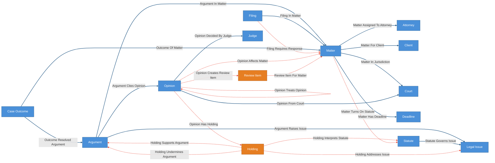
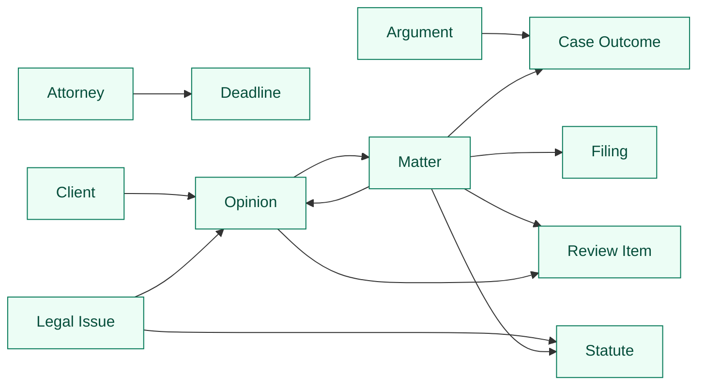

# Case Law Monitoring Demo

Single-layer Cruxible world model for legal monitoring alongside a specialized
law agent. The kit is not trying to replace legal reasoning. It gives the agent
and attorney a governed memory of what has been reviewed: holdings, citation
treatment, matter statutory scope, argument impact, filing obligations, matter
impact, and review obligations.

The canonical layer is intentionally practical: opinions, courts, judges,
statutes, legal issues, clients, firm matters, filings, deadlines, attorneys,
arguments, and case outcomes. The governed layer captures legal judgments that
should compound over time:

`opinion/filing -> holding/treatment/scope -> issue/statute -> argument -> matter/client/deadline -> review item/outcome`

The usage story is:

> A new opinion or filing arrives. A legal agent proposes the legal judgment
> edges it implies, attorney review converts accepted judgments into reusable
> matter-context state, and later outcomes tell the kit which proposal paths
> actually helped the firm.

Everything between `CRUXIBLE:BEGIN` / `CRUXIBLE:END` markers is regenerated
from `config.yaml` by `cruxible config-views`; treat those blocks as code-owned
structural truth. Everything outside those marker blocks is authored explanation
for humans and agents reading the kit.

## Modeling Notes

This first pass intentionally avoids a reference world. CourtListener, PACER, or
firm DMS integrations can supply opinions and filings later, but this config is
about the local legal-workflow layer: which authorities matter to this firm,
which clients and matters they affect, which arguments they support or
undermine, what filing obligations they create, and what review work follows.

The important Cruxible distinction is that the agent can read broadly, but the
firm should only rely on reviewed legal-judgment edges downstream. A rejected
impact proposal still teaches the system: it narrows future matter-impact
matching, citation-treatment routing, filing-obligation classification, and
review-item generation.

## Ontology Map

Entity types and relationships, color-coded by layer. Solid blue lines are
deterministic canonical state. Dashed red lines are governed proposal/review
relationships.

<!-- CRUXIBLE:BEGIN ontology -->

<!-- CRUXIBLE:END ontology -->

**Legend:** Blue = canonical/deterministic state | Orange = governed-only
judgment object | Solid blue lines = deterministic | Dashed red lines =
governed proposal/review.

## Workflow Summary

The generated pipeline gives the stage order. The generated stage blocks
underneath show which context each procedure reads, which relationship it
proposes, and which provider source implements the behavior.

<!-- CRUXIBLE:BEGIN workflow-pipeline -->

<!-- CRUXIBLE:END workflow-pipeline -->

<!-- CRUXIBLE:BEGIN workflow-summary -->
### 1. Propose Filing Response

**Role:** Governed proposal

**Input context**
- Entity context: Deadline, Filing, Matter

**Result**
- Proposed relationships: Filing Requires Response

**Provider source**
- Assess Filing Response Obligations (Python Function, v0.1.0); source: `demos/case_law_monitoring/providers.py::assess_filing_response_obligations`; non-deterministic

### 2. Propose Holdings From Opinion

**Role:** Governed proposal

**Input context**
- Entity context: Opinion

**Result**
- Proposed relationships: Opinion Has Holding

**Provider source**
- Extract Holdings From Opinions (Python Function, v0.1.0); source: `demos/case_law_monitoring/providers.py::extract_holdings_from_opinions`; non-deterministic

### 3. Propose Matter Statutory Scope

**Role:** Governed proposal

**Input context**
- Entity context: Matter, Statute

**Result**
- Proposed relationships: Matter Turns On Statute

**Provider source**
- Scope Matters To Statutes (Python Function, v0.1.0); source: `demos/case_law_monitoring/providers.py::scope_matters_to_statutes`; non-deterministic

### 4. Propose Opinion Treatment

**Role:** Governed proposal

**Input context**
- Entity context: Opinion
- Relationship context: Opinion Cites Opinion

**Result**
- Proposed relationships: Opinion Treats Opinion

**Provider source**
- Classify Opinion Treatment (Python Function, v0.1.0); source: `demos/case_law_monitoring/providers.py::classify_opinion_treatment`; non-deterministic

### 5. Propose Statute Interpretations

**Role:** Governed proposal

**Input context**
- Entity context: Holding, Opinion, Statute
- Relationship context: Opinion Has Holding

**Result**
- Proposed relationships: Holding Interprets Statute

**Provider source**
- Link Holdings To Statutes (Python Function, v0.1.0); source: `demos/case_law_monitoring/providers.py::link_holdings_to_statutes`; non-deterministic

### 6. Propose Holding Issue Links

**Role:** Governed proposal

**Input context**
- Entity context: Holding, Legal Issue
- Relationship context: Holding Interprets Statute

**Result**
- Proposed relationships: Holding Addresses Issue

**Provider source**
- Map Holdings To Issues (Python Function, v0.1.0); source: `demos/case_law_monitoring/providers.py::map_holdings_to_issues`; non-deterministic

### 7. Propose Argument Risk

**Role:** Governed proposal

**Input context**
- Entity context: Argument, Holding
- Relationship context: Argument Raises Issue, Holding Addresses Issue

**Result**
- Proposed relationships: Holding Undermines Argument

**Provider source**
- Assess Argument Impact (Python Function, v0.1.0); source: `demos/case_law_monitoring/providers.py::assess_argument_impact`; non-deterministic

### 8. Propose Argument Support

**Role:** Governed proposal

**Input context**
- Entity context: Argument, Holding
- Relationship context: Argument Raises Issue, Holding Addresses Issue

**Result**
- Proposed relationships: Holding Supports Argument

**Provider source**
- Assess Argument Impact (Python Function, v0.1.0); source: `demos/case_law_monitoring/providers.py::assess_argument_impact`; non-deterministic

### 9. Propose Matter Impact

**Role:** Governed proposal

**Input context**
- Entity context: Matter, Opinion
- Relationship context: Holding Supports Argument, Holding Undermines Argument, Matter Turns On Statute, Opinion Treats Opinion

**Result**
- Proposed relationships: Opinion Affects Matter

**Provider source**
- Assess Matter Impact (Python Function, v0.1.0); source: `demos/case_law_monitoring/providers.py::assess_matter_impact`; non-deterministic

### 10. Propose Review Items

**Role:** Governed proposal

**Input context**
- Entity context: Matter, Opinion
- Relationship context: Opinion Affects Matter, Opinion Treats Opinion

**Result**
- Proposed relationships: Opinion Creates Review Item

**Provider source**
- Route Review Items (Python Function, v0.1.0); source: `demos/case_law_monitoring/providers.py::route_review_items`; non-deterministic

### 11. Propose Review Item Matter Links

**Role:** Governed proposal

**Input context**
- Entity context: Matter, Opinion
- Relationship context: Opinion Affects Matter, Opinion Creates Review Item, Opinion Treats Opinion

**Result**
- Proposed relationships: Review Item For Matter

**Provider source**
- Route Review Items (Python Function, v0.1.0); source: `demos/case_law_monitoring/providers.py::route_review_items`; non-deterministic
<!-- CRUXIBLE:END workflow-summary -->

## Governed Relationships

This table is generated from matching, decision policy, feedback, and outcome
profile config. It shows the reviewed legal-judgment layer the agent can use as
durable context.

<!-- CRUXIBLE:BEGIN governance-table -->
| Relationship | Scope | Signals | Auto-resolve Gate | Review Policy | Feedback | Outcomes |
| --- | --- | --- | --- | --- | --- | --- |
| Filing Requires Response | Filing -> Matter | Attorney Review, Docket Matter Match, Filing Obligation Assessor | All Support; prior trust: Trusted Only | Require Review: Filing Obligations Require Review | 3 reason codes | Filing Response Resolution |
| Holding Addresses Issue | Holding -> Legal Issue | Attorney Review, Issue Mapper | All Support; prior trust: Trusted Only | Trust-gated auto-resolve | 2 reason codes | - |
| Holding Interprets Statute | Holding -> Statute | Attorney Review, Statute Interpretation Extractor | All Support; prior trust: Trusted Only | Trust-gated auto-resolve | 3 reason codes | - |
| Holding Supports Argument | Holding -> Argument | Argument Impact Assessor, Attorney Review | All Support; prior trust: Trusted Only | Trust-gated auto-resolve | 2 reason codes | - |
| Holding Undermines Argument | Holding -> Argument | Argument Impact Assessor, Attorney Review | All Support; prior trust: Trusted Only | Trust-gated auto-resolve | 3 reason codes | - |
| Matter Turns On Statute | Matter -> Statute | Attorney Review, Matter Statute Match | All Support; prior trust: Trusted Only | Require Review: Matter Scope Requires Review | 3 reason codes | Matter Scope Resolution |
| Opinion Affects Matter | Opinion -> Matter | Attorney Review, Jurisdiction Overlap, Matter Impact Assessor | All Support; prior trust: Trusted Only | Require Review: Matter Impacts Require Review | 3 reason codes | Matter Impact Resolution |
| Opinion Creates Review Item | Opinion -> Review Item | Attorney Review, Review Item Router | All Support; prior trust: Trusted Only | Trust-gated auto-resolve | 2 reason codes | - |
| Opinion Has Holding | Opinion -> Holding | Attorney Review, Holding Extractor | All Support; prior trust: Trusted Only | Trust-gated auto-resolve | 3 reason codes | - |
| Opinion Treats Opinion | Opinion -> Opinion | Attorney Review, Citation Treatment Classifier | All Support; prior trust: Trusted Only | Require Review: Negative Treatment Requires Review | 3 reason codes | Treatment Resolution |
| Review Item For Matter | Review Item -> Matter | Attorney Review, Review Item Router | All Support; prior trust: Trusted Only | Trust-gated auto-resolve | 2 reason codes | - |
<!-- CRUXIBLE:END governance-table -->

## Query Map

Named queries are the main context surfaces for the legal agent. The map shows
entry/return affordances; the catalog gives the traversal and intended use.

<!-- CRUXIBLE:BEGIN query-map -->

<!-- CRUXIBLE:END query-map -->

<!-- CRUXIBLE:BEGIN query-catalog -->
### Argument

| Query | Returns | Traversal | Purpose |
| --- | --- | --- | --- |
| Argument Track Record | Case Outcome | Outcome Resolved Argument (Incoming) | Starting from an argument, find case outcomes where that argument was resolved or evaluated. |

### Attorney

| Query | Returns | Traversal | Purpose |
| --- | --- | --- | --- |
| Deadline Watch | Deadline | Matter Assigned To Attorney (Incoming) -> Matter Has Deadline (Outgoing) | Starting from an attorney, find deadlines across assigned matters. |

### Client

| Query | Returns | Traversal | Purpose |
| --- | --- | --- | --- |
| Client Impact Watch | Opinion | Matter For Client (Incoming) -> Opinion Affects Matter (Incoming) | Starting from a client, find opinions judged to affect that client's matters. |

### Legal Issue

| Query | Returns | Traversal | Purpose |
| --- | --- | --- | --- |
| Precedent Chain For Issue | Opinion | Holding Addresses Issue (Incoming) -> Opinion Has Holding (Incoming) | Starting from a legal issue, find opinions with reviewed holdings that address the issue. |
| Statutory Interpretations For Issue | Statute | Holding Addresses Issue (Incoming) -> Holding Interprets Statute (Outgoing) | Starting from a legal issue, find statutes interpreted by holdings addressing that issue. |

### Matter

| Query | Returns | Traversal | Purpose |
| --- | --- | --- | --- |
| Adverse Authority For Matter | Opinion | Argument In Matter (Incoming) -> Holding Undermines Argument (Incoming) -> Opinion Has Holding (Incoming) | Starting from a matter, find opinions whose holdings undermine arguments in that matter. |
| Case Outcomes For Matter | Case Outcome | Outcome Of Matter (Incoming) | Starting from a matter, find case outcomes recorded for that matter. |
| Filing Response Obligations For Matter | Filing | Filing Requires Response (Incoming) | Starting from a matter, find filings judged to require a response or deadline. |
| Matter Statutory Scope | Statute | Matter Turns On Statute (Outgoing) | Starting from a matter, find statutes and doctrines accepted as within the matter's legal scope. |
| Negative Treatment For Cited Authorities | Opinion | Argument In Matter (Incoming) -> Argument Cites Opinion (Outgoing) -> Opinion Treats Opinion (Incoming) | Starting from a matter, find new opinions that negatively treat authorities cited by matter arguments. |
| Review Items For Matter | Review Item | Review Item For Matter (Incoming) | Starting from a matter, find open or historical review items created by monitored opinions. |
| Supporting Authority For Matter | Opinion | Argument In Matter (Incoming) -> Holding Supports Argument (Incoming) -> Opinion Has Holding (Incoming) | Starting from a matter, find opinions whose holdings support arguments in that matter. |

### Opinion

| Query | Returns | Traversal | Purpose |
| --- | --- | --- | --- |
| Matters Impacted By Opinion | Matter | Opinion Affects Matter (Outgoing) | Starting from an opinion, find matters judged affected by that opinion. |
| Opinion Review Items | Review Item | Opinion Creates Review Item (Outgoing) | Starting from an opinion, find review items created by that opinion. |
<!-- CRUXIBLE:END query-catalog -->

## Compounding Knowledge Procedure

1. Register matter portfolio anchors: clients, matters, attorneys, arguments,
   deadlines, issues, cited authorities, courts, and statutes.
2. Register new monitored opinions and filings from alerts, docket feeds,
   research, or attorney review.
3. Propose matter statutory scope, holdings, citation treatment, statute
   interpretation, and issue mappings.
4. Propose support/risk links between reviewed holdings and matter arguments.
5. Propose matter-impact, filing-response, and review-item edges for attorney
   review.
6. Use named queries to supply the legal agent with reviewed adverse authority,
   supporting authority, impacted clients/matters, deadline obligations, and
   open review obligations.
7. Record case outcomes and argument results as canonical matter history.
8. Feed review feedback and later outcomes back into provider fixes, decision
   policies, constraints, and trust calibration.

## Usage Stories

- **New opinion triage:** determine whether a monitored opinion affects active
  matters or only belongs in background research.
- **Client impact watch:** start from a client and surface opinions judged to
  affect that client's matters.
- **Filing obligation review:** determine whether a new filing creates a
  response, deadline, or client-update obligation.
- **Adverse authority check:** surface opinions that undermine arguments in a
  matter before a filing or client update.
- **Cited-authority health:** identify new negative treatment of opinions a
  matter already relies on.
- **Argument track record:** use resolved case outcomes to show how similar
  arguments have performed across matters.
- **Matter review queue:** create attorney-review items when authority changes
  the risk posture of a matter.
- **Practice memory:** preserve reviewed impact decisions so future opinions are
  compared against firm-specific matter history, not generic legal memory.

## Open Design Questions

- Should `Holding` be registered as a lightweight entity by the agent before
  relationship proposals, or should Cruxible add first-class governed entity
  proposals?
- Which parts of opinion metadata should eventually live in a reference layer
  versus this local firm layer?
- Should review-item routing be one workflow with multiple proposed
  relationships, or remain split into explicit `opinion -> review item` and
  `review item -> matter` proposals?
- Which matter-impact edges should ever become trust-gated rather than always
  attorney-reviewed?

## Maintenance

Regenerate the structural sections after changing ontology, workflows, governed
relationships, or named queries:

```bash
uv run cruxible config-views --config demos/case-law-monitoring/config.yaml --update-readme demos/case-law-monitoring/README.md
```

To inspect the same generated bundle without editing the README:

```bash
uv run cruxible config-views --config demos/case-law-monitoring/config.yaml --view all
```

## Status

This is a first-pass config and README. Provider refs are placeholders, no seed
data is included, and the first real-usage iteration should focus on one
end-to-end story: new opinion or filing, proposed treatment/scope/impact edges,
attorney feedback, named-query context for the next agent recommendation, and a
later outcome that teaches the next pass.
