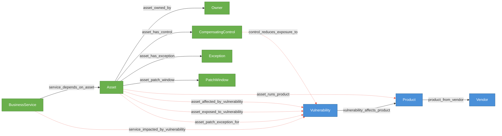

# KEV Triage

Forkable cyber world model for vulnerability and KEV triage.

## Structure

This demo has two configs that represent the two layers:

- **`kev-reference.yaml`** — the published upstream world model. Contains only
  public entity types (Vendor, Product, Vulnerability), deterministic reference
  relationships, plus a canonical workflow that builds accepted reference state
  from the bundled hashed KEV/NVD/EPSS artifact. This is what Cruxible hosts
  and keeps updated from public feeds. Read-only to forks.

- **`config.yaml`** — a customer fork that uses `extends: kev-reference.yaml`.
  Adds internal entity types, deterministic internal mappings, governed judgment
  relationships, feedback and outcome profiles, quality checks, and named queries
  that traverse across both layers.

## Schema Diagram

Entity types and relationships, color-coded by layer. Dashed lines are governed
relationships that go through the proposal/group resolution flow.

**Legend:** Blue = reference layer (upstream, read-only) | Green = fork (internal) | Solid lines = deterministic | Dashed red lines = governed (proposal/review)

## Governed Relationships

Each governed relationship has a `matching` block, integrations that provide signals, and linked feedback/outcome profiles for the Loop 1/2 flywheel.

| Relationship | Integrations | Roles | Auto-resolve | Feedback Profile | Outcome Profile |
|---|---|---|---|---|---|
| `asset_runs_product` | `software_product_match` | required | all_support | `asset_runs_product` | `asset_runs_product_resolution` |
| `asset_affected_by_vulnerability` | `product_version_evidence` | required | all_support | `asset_affected_by_vulnerability` | `asset_affected_resolution` |
| `asset_exposed_to_vulnerability` | `exploitability_signal`, `control_effectiveness` | required, required | all_support | `asset_exposed_to_vulnerability` | `asset_exposed_resolution` |
| `service_impacted_by_vulnerability` | `dependency_context` | required | all_support | `service_impacted_by_vulnerability` | — |
| `asset_patch_exception_for` | `policy_review` | required | all_support | `asset_patch_exception_for` | — |
| `control_reduces_exposure_to` | `control_effectiveness` | required | all_support | `control_reduces_exposure_to` | — |

### Integration signals

| Integration | Kind | Notes |
|---|---|---|
| `software_product_match` | software_product_fuzzy_match | Fuzzy match internal software names to CPE product IDs |
| `product_version_evidence` | product_version_match | Check installed version against NVD affected ranges |
| `exploitability_signal` | exploitability_assessment | Is the vulnerability practically exploitable on this asset? |
| `control_effectiveness` | compensating_control_review | Does a control block the exploit path? |
| `dependency_context` | service_dependency_context | Does a real dependency path connect service to affected asset? |
| `policy_review` | remediation_policy_review | Is the patch exception still valid per policy? |

## Rules Summary

### Constraints

No fork-specific constraints yet — these emerge from feedback analysis (Loop 1).

### Quality checks

| Name | Kind | Target | Severity | What it checks |
|---|---|---|---|---|
| `assets_have_one_owner` | cardinality | Asset -> asset_owned_by (out) | warning | Every asset has exactly one owner |
| `minimum_assets_loaded` | bounds | Asset count >= 5 | warning | CMDB load isn't empty |
| `assets_have_hostname` | property | Asset.hostname non_empty | warning | No blank hostnames |
| `no_empty_affected_version_objects`* | json_content | vulnerability_affects_product.affected_versions | error | No empty objects in version arrays |
| `affected_versions_have_useful_keys`* | json_content | vulnerability_affects_product.affected_versions | warning | At least one version range key present |
| `products_have_exactly_one_vendor`* | cardinality | Product -> product_from_vendor (out) | error | Every product has exactly one vendor |

*From the reference layer (inherited via composition).

## Feedback Profiles (Loop 1)

Structured reason codes agents attach to feedback, enabling `analyze_feedback` to
produce constraint and decision policy suggestions.

| Profile | Reason Codes | Scope Keys |
|---|---|---|
| `asset_runs_product` | `wrong_product_match` (provider_fix), `version_mismatch` (quality_check), `stale_inventory` (provider_fix) | product, hostname, evidence_source |
| `asset_affected_by_vulnerability` | `version_not_in_range` (constraint), `product_mismatch` (provider_fix) | cve, product, hostname |
| `asset_exposed_to_vulnerability` | `control_mitigates` (decision_policy), `not_internet_reachable` (constraint), `epss_score_stale` (provider_fix) | cve, criticality, environment |
| `service_impacted_by_vulnerability` | `no_dependency_path` (constraint), `service_decommissioned` (quality_check) | service, cve |
| `asset_patch_exception_for` | `exception_expired` (constraint), `scope_mismatch` (decision_policy) | cve, exception_id |
| `control_reduces_exposure_to` | `control_not_validated` (quality_check), `wrong_vulnerability_class` (constraint) | control_type, cve |

Remediation hints in parentheses tell `analyze_feedback` what kind of suggestion to produce.

## Outcome Profiles (Loop 2)

Structured outcome codes for trust calibration (resolution-anchored) and query
surface assessment (receipt-anchored).

### Resolution-anchored (was this proposal resolution correct?)

| Profile | Relationship | Outcome Codes |
|---|---|---|
| `asset_runs_product_resolution` | asset_runs_product | `wrong_product_match` (trust_adjustment), `version_drift` (provider_fix) |
| `asset_affected_resolution` | asset_affected_by_vulnerability | `wrong_affected_judgment` (trust_adjustment), `missed_affected_asset` (require_review), `version_range_error` (provider_fix) |
| `asset_exposed_resolution` | asset_exposed_to_vulnerability | `overestimated_exposure` (trust_adjustment), `underestimated_exposure` (require_review) |

### Receipt-anchored (did this query give a good answer?)

| Profile | Surface | Outcome Codes |
|---|---|---|
| `kev_assets_query` | query: kev_assets | `missing_results` (graph_fix), `false_positive_result` (graph_fix) |
| `owner_patch_queue_query` | query: owner_patch_queue | `stale_priority` (graph_fix), `missing_exposure` (workflow_fix) |

## Named Queries

Cross-layer traversals that start from one entity type and follow relationships
across the reference and fork layers.

| Query | Entry Point | Returns | Traversal |
|---|---|---|---|
| `kev_assets` | Vulnerability | Asset | <- asset_affected_by_vulnerability |
| `service_blast_radius` | Vulnerability | BusinessService | <- service_impacted_by_vulnerability |
| `owner_patch_queue` | Owner | Vulnerability | <- asset_owned_by -> asset_exposed_to_vulnerability |
| `product_kev_exposure` | Product | Asset | <- vulnerability_affects_product <- asset_affected_by_vulnerability |
| `asset_exception_context` | Asset | Exception | -> asset_has_exception |
| `asset_control_context` | Asset | CompensatingControl | -> asset_has_control |

## Workflows

The fork defines two workflows that replace the deprecated ingestion mappings.

| Workflow | Canonical | Steps | Purpose |
|---|---|---|---|
| `build_fork_state` | yes | 23 | Load deterministic entities (Assets, Owners, Services, Controls, Exceptions, PatchWindows) and relationships from seed data, apply to graph |
| `propose_asset_products` | no | 7 | Load software inventory, load reference product catalog, fuzzy match, build candidates, map signals, propose governed `asset_runs_product` edges |

The reference layer also contributes `build_public_kev_reference` (11 steps, canonical) via composition.

### Providers

| Provider | Input | Output | Artifact | Purpose |
|---|---|---|---|---|
| `load_fork_seed_data` | EmptyInput | ForkSeedData | fork_seed_bundle | Load all seed CSVs into structured arrays |
| `load_software_inventory` | EmptyInput | SoftwareInventory | fork_seed_bundle | Load software_inventory.csv |
| `load_reference_product_catalog` | EmptyInput | ReferenceProductCatalog | public_kev_bundle | Load canonical products from reference data |
| `match_software_to_products` | SoftwareMatchInput | SoftwareMatchResults | — | Fuzzy match software names to CPE product IDs |

The reference layer also contributes `load_public_kev_rows` via composition.

### Execution order

1. `build_public_kev_reference` — build the reference graph (Vendor, Product, Vulnerability)
2. `build_fork_state` — load internal entities and deterministic edges
3. `propose_asset_products` — fuzzy match software inventory against reference products, propose governed edges

Step 3 produces group proposals that enter the resolution lifecycle based on `asset_runs_product`'s matching config.

## Seed Data

Synthetic test data lives in `data/seed/`. These CSVs represent what a business
would have readily available from internal systems — CMDB exports, software
inventory, service catalogs, and operations data — using the business's own
naming conventions, not CPE identifiers. The gap between internal names and
reference-layer product IDs is the fuzzy matching problem that the
`asset_runs_product` governed relationship solves through the proposal flow.

See `data/seed/software_inventory.csv` for the key file — it contains software
names and versions as the business knows them, which need to be matched to
reference-layer products through `software_product_match` proposals.
