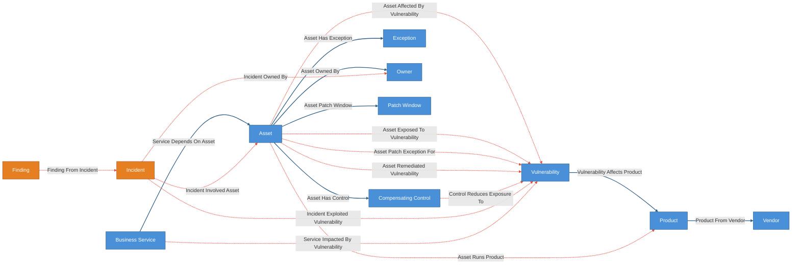
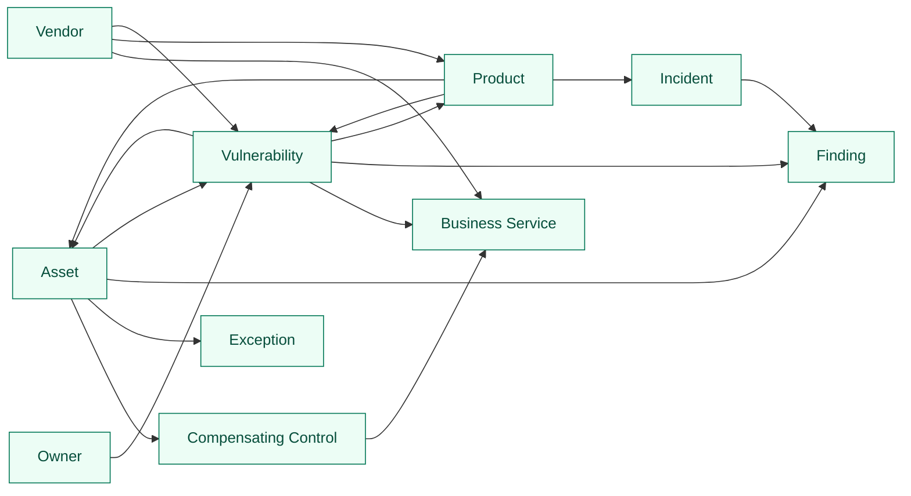

# KEV Triage

Forkable cyber world model for vulnerability and KEV triage.

## Skills

- [skills/kev-start/SKILL.md](skills/kev-start/SKILL.md) — adapt the KEV kit
  to your own asset, inventory, and service-mapping data
- [skills/kev-triage/SKILL.md](skills/kev-triage/SKILL.md) — the packaged
  daily triage / incident / waiver / control-effectiveness loop

## Structure

This demo has two configs that represent the two layers:

- **`kev-reference.yaml`** — the published upstream world model. Contains only
  public entity types (Vendor, Product, Vulnerability), deterministic reference
  relationships, plus a canonical workflow that builds accepted reference state
  from the bundled hashed KEV/NVD/EPSS artifact. This is what Cruxible hosts
  and keeps updated from public feeds. Read-only to forks.

- **`config.yaml`** — a customer fork that uses `extends: kev-reference.yaml`.
  Adds internal entity types, deterministic internal mappings, governed judgment
  relationships, feedback and outcome profiles, quality checks, and named queries
  that traverse across both layers.

Everything between `CRUXIBLE:BEGIN` / `CRUXIBLE:END` markers is regenerated
from `config.yaml` by `cruxible config-views --runtime`; treat those
blocks as code-owned structural truth. Everything outside those marker blocks
is authored explanation for humans and agents reading the kit.

## Ontology Map

The runtime composed view includes inherited reference entities and relationships
plus the extension's internal and governed surfaces. Solid blue lines are
deterministic canonical state. Dashed red lines are governed proposal/review
relationships.

<!-- CRUXIBLE:BEGIN ontology -->

<!-- CRUXIBLE:END ontology -->

**Legend:** Blue = canonical/deterministic state, including the inherited KEV
reference layer | Orange = governed-only trigger/judgment entities | Solid blue
lines = deterministic | Dashed red lines = governed proposal/review.

## Workflow Summary

The generated pipeline gives the onboarding order. The generated stage
blocks underneath keep long context and provider provenance readable without
squeezing them into a wide table.

```mermaid
flowchart LR
  classDef canonicalWorkflow fill:#4a90d9,stroke:#2c5f8a,color:#fff
  classDef governedWorkflow fill:#e67e22,stroke:#a0521c,color:#fff

  workflow_pipeline_build_fork_state["1. Seed canonical state<br/>Canonical"]
  workflow_pipeline_propose_asset_products["2. Asset Runs Product<br/>Governed proposal"]
  workflow_pipeline_propose_asset_affected["3. Asset Affected By Vulnerability<br/>Governed proposal"]
  workflow_pipeline_propose_asset_exposure["4. Asset Exposed To Vulnerability<br/>Governed proposal"]
  workflow_pipeline_propose_service_impact["5. Service Impacted By Vulnerability<br/>Governed proposal"]
  workflow_pipeline_build_fork_state --> workflow_pipeline_propose_asset_products
  workflow_pipeline_propose_asset_products --> workflow_pipeline_propose_asset_affected
  workflow_pipeline_propose_asset_affected --> workflow_pipeline_propose_asset_exposure
  workflow_pipeline_propose_asset_exposure --> workflow_pipeline_propose_service_impact
  class workflow_pipeline_build_fork_state canonicalWorkflow
  class workflow_pipeline_propose_asset_products,workflow_pipeline_propose_asset_affected,workflow_pipeline_propose_asset_exposure,workflow_pipeline_propose_service_impact governedWorkflow
```

<!-- CRUXIBLE:BEGIN workflow-pipeline -->

<!-- CRUXIBLE:END workflow-pipeline -->

<!-- CRUXIBLE:BEGIN workflow-summary -->
### 1. Build Fork State

**Role:** Canonical seed

**Input context**
- None (seeds canonical state)

**Result**
- Canonical entities: Asset, Business Service, Compensating Control, Exception, Owner, Patch Window
- Canonical relationships: Asset Has Control, Asset Has Exception, Asset Owned By, Asset Patch Window, Service Depends On Asset

**Provider source**
- Load Fork Seed Data (Python Function, v1.0.0); source: `src/cruxible_core/demo_providers/kev_triage.py::load_fork_seed_data`; artifact: Fork Seed Bundle

### 2. Propose Asset Products

**Role:** Governed proposal

**Input context**
- Entity context: Product

**Result**
- Proposed relationships: Asset Runs Product

**Provider source**
- Load Software Inventory (Python Function, v1.0.0); source: `src/cruxible_core/demo_providers/kev_triage.py::load_software_inventory`; artifact: Fork Seed Bundle
- Match Software To Products (Python Function, v1.0.0); source: `src/cruxible_core/demo_providers/kev_triage.py::match_software_to_products`

### 3. Propose Asset Affected

**Role:** Governed proposal

**Input context**
- Relationship context: Asset Runs Product, Vulnerability Affects Product

**Result**
- Proposed relationships: Asset Affected By Vulnerability

**Provider source**
- Assess Asset Affected (Python Function, v1.0.0); source: `src/cruxible_core/demo_providers/kev_triage.py::assess_asset_affected`

### 4. Propose Asset Exposure

**Role:** Governed proposal

**Input context**
- Entity context: Asset, Compensating Control
- Relationship context: Asset Affected By Vulnerability, Asset Has Control

**Result**
- Proposed relationships: Asset Exposed To Vulnerability

**Provider source**
- Assess Asset Exposure (Python Function, v1.0.0); source: `src/cruxible_core/demo_providers/kev_triage.py::assess_asset_exposure`

### 5. Propose Service Impact

**Role:** Governed proposal

**Input context**
- Entity context: Business Service
- Relationship context: Asset Exposed To Vulnerability, Service Depends On Asset

**Result**
- Proposed relationships: Service Impacted By Vulnerability

**Provider source**
- Assess Service Impact (Python Function, v1.0.0); source: `src/cruxible_core/demo_providers/kev_triage.py::assess_service_impact`
<!-- CRUXIBLE:END workflow-summary -->

## Governed Relationships

Each governed relationship has a `matching` block, integrations that provide
signals, and linked feedback/outcome profiles for the Loop 1/2 flywheel.

<!-- CRUXIBLE:BEGIN governance-table -->
| Relationship | Scope | Signals | Auto-resolve Gate | Review Policy | Feedback | Outcomes |
| --- | --- | --- | --- | --- | --- | --- |
| Asset Affected By Vulnerability | Asset -> Vulnerability | Product Version Evidence | All Support; prior trust: Trusted Only | Trust-gated auto-resolve | 2 reason codes | Asset Affected Resolution |
| Asset Exposed To Vulnerability | Asset -> Vulnerability | Control Effectiveness, Exploitability Signal | All Support; prior trust: Trusted Only | Trust-gated auto-resolve | 3 reason codes | Asset Exposed Resolution |
| Asset Patch Exception For | Asset -> Vulnerability | Policy Review | All Support; prior trust: Trusted Only | Trust-gated auto-resolve | 2 reason codes | - |
| Asset Remediated Vulnerability | Asset -> Vulnerability | Remediation Verification | All Support; prior trust: Trusted Only | Trust-gated auto-resolve | 3 reason codes | Asset Remediated Resolution |
| Asset Runs Product | Asset -> Product | Software Product Match | All Support; prior trust: Trusted Only | Trust-gated auto-resolve | 3 reason codes | Asset Runs Product Resolution |
| Control Reduces Exposure To | Compensating Control -> Vulnerability | Control Effectiveness | All Support; prior trust: Trusted Only | Trust-gated auto-resolve | 2 reason codes | - |
| Finding From Incident | Finding -> Incident | Incident Attribution | All Support; prior trust: Trusted Only | Trust-gated auto-resolve | 2 reason codes | - |
| Incident Exploited Vulnerability | Incident -> Vulnerability | Incident Attribution | All Support; prior trust: Trusted Only | Trust-gated auto-resolve | 2 reason codes | Incident Attribution Resolution |
| Incident Involved Asset | Incident -> Asset | Incident Attribution | All Support; prior trust: Trusted Only | Trust-gated auto-resolve | 2 reason codes | - |
| Incident Owned By | Incident -> Owner | Incident Attribution | All Support; prior trust: Trusted Only | Trust-gated auto-resolve | 2 reason codes | - |
| Service Impacted By Vulnerability | Business Service -> Vulnerability | Dependency Context | All Support; prior trust: Trusted Only | Trust-gated auto-resolve | 2 reason codes | - |
<!-- CRUXIBLE:END governance-table -->

### Integration Signal Notes

| Integration | Kind | Notes |
|---|---|---|
| `software_product_match` | software_product_fuzzy_match | Fuzzy match internal software names to CPE product IDs |
| `product_version_evidence` | product_version_match | Check installed version against NVD affected ranges |
| `exploitability_signal` | exploitability_assessment | Is the vulnerability practically exploitable on this asset? |
| `control_effectiveness` | compensating_control_review | Does a control block the exploit path? |
| `dependency_context` | service_dependency_context | Does a real dependency path connect service to affected asset? |
| `policy_review` | remediation_policy_review | Is the patch exception still valid per policy? |
| `incident_attribution` | incident_investigation | Agent/human judgment linking incidents to assets, vulnerabilities, and findings |

## Query Map

Named queries are graph-native read surfaces. The map shows entry/return
affordances; query names and traversal details live in the generated catalog.

<!-- CRUXIBLE:BEGIN query-map -->

<!-- CRUXIBLE:END query-map -->

## Query Catalog

Use the catalog to decide which KEV surfaces survive onboarding for a user's
data. Composition, presentation, and operator summaries should happen in the
skill or agent harness, not by turning every useful traversal into a governed
relationship.

<!-- CRUXIBLE:BEGIN query-catalog -->
### Asset

| Query | Returns | Traversal | Purpose |
| --- | --- | --- | --- |
| Asset Control Context | Compensating Control | Asset Has Control (Outgoing) | Starting from an asset, find compensating controls currently attached to it. |
| Asset Exception Context | Exception | Asset Has Exception (Outgoing) | Starting from an asset, find exception records currently attached to it. |
| Asset Remediation Context | Vulnerability | Asset Remediated Vulnerability (Outgoing) | Starting from an asset, find vulnerabilities that have been explicitly marked remediated for that asset. |
| Open Findings For Asset | Finding | Incident Involved Asset (Incoming) -> Finding From Incident (Incoming) | Starting from an asset, find open findings from incidents that involved this asset. Filters out remediated findings. Answers: "What unresolved root causes exist for this asset?" |

### Compensating Control

| Query | Returns | Traversal | Purpose |
| --- | --- | --- | --- |
| Control Coverage Gap | Business Service | Asset Has Control (Incoming) -> Asset Exposed To Vulnerability (Outgoing) -> Service Impacted By Vulnerability (Incoming) | Starting from a compensating control, find the business services that would lose coverage if this control were disabled or invalidated. Traces from control through covered assets to exposed vulnerabilities to dependent services. |

### Incident

| Query | Returns | Traversal | Purpose |
| --- | --- | --- | --- |
| Finding Status For Incident | Finding | Finding From Incident (Incoming) | Starting from an incident, find all findings. Answers: "Are all root causes from this incident addressed?" |

### Owner

| Query | Returns | Traversal | Purpose |
| --- | --- | --- | --- |
| Owner Patch Queue | Vulnerability | Asset Owned By (Incoming) -> Asset Exposed To Vulnerability (Outgoing) | Starting from an owner, find exposed vulnerabilities across the owner's assets. |

### Product

| Query | Returns | Traversal | Purpose |
| --- | --- | --- | --- |
| Incident History For Product | Incident | Vulnerability Affects Product (Incoming) -> Incident Exploited Vulnerability (Incoming) | Starting from a product, find incidents where vulnerabilities affecting this product were exploited. Answers: "Has this product been exploited before in our environment?" |
| Product Kev Exposure | Asset | Vulnerability Affects Product (Incoming) -> Asset Affected By Vulnerability (Incoming) | Starting from a product, find KEV or CVE records known to affect it and the assets that are currently accepted as affected. |
| Product Vulnerabilities | Vulnerability | Vulnerability Affects Product (Incoming) | Starting from a product, find vulnerabilities that affect it. |

### Vendor

| Query | Returns | Traversal | Purpose |
| --- | --- | --- | --- |
| Vendor Products | Product | Product From Vendor (Incoming) | Starting from a vendor, find products published by that vendor. |
| Vendor Service Impact | Business Service | Product From Vendor (Incoming) -> Vulnerability Affects Product (Incoming) -> Asset Affected By Vulnerability (Incoming) -> Service Depends On Asset (Incoming) | Starting from a vendor, trace through affected products, confirmed vulnerable assets, and service dependencies to find business services in the blast radius. This is the question you ask when a vendor discloses a breach or a critical supply-chain vulnerability. |
| Vendor Vulnerabilities | Vulnerability | Product From Vendor (Incoming) -> Vulnerability Affects Product (Incoming) | Starting from a vendor, find all vulnerabilities across that vendor's products. |

### Vulnerability

| Query | Returns | Traversal | Purpose |
| --- | --- | --- | --- |
| Kev Assets | Asset | Asset Affected By Vulnerability (Incoming) | Starting from a vulnerability, find internal assets that are currently accepted as affected. |
| Prior Exploitation Context | Finding | Incident Exploited Vulnerability (Incoming) -> Finding From Incident (Incoming) | Starting from a vulnerability, find incidents where it was exploited and the findings from those investigations. Answers: "What did we learn last time this CVE was exploited?" |
| Remediated Assets For Vulnerability | Asset | Asset Remediated Vulnerability (Incoming) | Starting from a vulnerability, find assets that have explicit remediation state recorded for it. |
| Service Blast Radius | Business Service | Service Impacted By Vulnerability (Incoming) | Starting from a vulnerability, find impacted business services. |
| Vulnerability Products | Product | Vulnerability Affects Product (Outgoing) | Starting from a vulnerability, find affected products. |
<!-- CRUXIBLE:END query-catalog -->

## Rules And Learning Loops

### Constraints

No fork-specific constraints yet — these emerge from feedback analysis
(Loop 1).

### Quality Checks

| Name | Kind | Target | Severity | What it checks |
|---|---|---|---|---|
| `assets_have_one_owner` | cardinality | Asset -> asset_owned_by (out) | warning | Every asset has exactly one owner |
| `minimum_assets_loaded` | bounds | Asset count >= 5 | warning | CMDB load isn't empty |
| `assets_have_hostname` | property | Asset.hostname non_empty | warning | No blank hostnames |
| `no_empty_affected_version_objects`* | json_content | vulnerability_affects_product.affected_versions | error | No empty objects in version arrays |
| `affected_versions_have_useful_keys`* | json_content | vulnerability_affects_product.affected_versions | warning | At least one version range key present |
| `products_have_exactly_one_vendor`* | cardinality | Product -> product_from_vendor (out) | error | Every product has exactly one vendor |

*From the reference layer (inherited via composition).

### Feedback Profiles (Loop 1)

Structured reason codes agents attach to feedback, enabling `analyze_feedback`
to produce constraint and decision policy suggestions.

| Profile | Reason Codes | Scope Keys |
|---|---|---|
| `asset_runs_product` | `wrong_product_match` (provider_fix), `version_mismatch` (quality_check), `stale_inventory` (provider_fix) | product, hostname, evidence_source |
| `asset_affected_by_vulnerability` | `version_not_in_range` (constraint), `product_mismatch` (provider_fix) | cve, product, hostname |
| `asset_exposed_to_vulnerability` | `control_mitigates` (decision_policy), `not_internet_reachable` (constraint), `epss_score_stale` (provider_fix) | cve, criticality, environment |
| `service_impacted_by_vulnerability` | `no_dependency_path` (constraint), `service_decommissioned` (quality_check) | service, cve |
| `asset_patch_exception_for` | `exception_expired` (constraint), `scope_mismatch` (decision_policy) | cve, exception_id |
| `control_reduces_exposure_to` | `control_not_validated` (quality_check), `wrong_vulnerability_class` (constraint) | control_type, cve |

Remediation hints in parentheses tell `analyze_feedback` what kind of
suggestion to produce.

### Outcome Profiles (Loop 2)

Structured outcome codes for trust calibration (resolution-anchored) and query
surface assessment (receipt-anchored).

#### Resolution-Anchored

| Profile | Relationship | Outcome Codes |
|---|---|---|
| `asset_runs_product_resolution` | asset_runs_product | `wrong_product_match` (trust_adjustment), `version_drift` (provider_fix) |
| `asset_affected_resolution` | asset_affected_by_vulnerability | `wrong_affected_judgment` (trust_adjustment), `missed_affected_asset` (require_review), `version_range_error` (provider_fix) |
| `asset_exposed_resolution` | asset_exposed_to_vulnerability | `overestimated_exposure` (trust_adjustment), `underestimated_exposure` (require_review) |

#### Receipt-Anchored

| Profile | Surface | Outcome Codes |
|---|---|---|
| `kev_assets_query` | query: kev_assets | `missing_results` (graph_fix), `false_positive_result` (graph_fix) |
| `owner_patch_queue_query` | query: owner_patch_queue | `stale_priority` (graph_fix), `missing_exposure` (workflow_fix) |

## Maintenance

Regenerate the structural sections after changing ontology, workflows,
governed relationships, or named queries:

```bash
uv run cruxible config-views --config demos/kev-triage/config.yaml --runtime --update-readme demos/kev-triage/README.md
```

To inspect the same generated bundle without editing the README:

```bash
uv run cruxible config-views --config demos/kev-triage/config.yaml --runtime --view all
```

## Seed Data

Synthetic test data lives in `data/seed/`. These CSVs represent what a business
would have readily available from internal systems — CMDB exports, software
inventory, service catalogs, and operations data — using the business's own
naming conventions, not CPE identifiers. The gap between internal names and
reference-layer product IDs is the fuzzy matching problem that the
`asset_runs_product` governed relationship solves through the proposal flow.

See `data/seed/software_inventory.csv` for the key file — it contains software
names and versions as the business knows them, which need to be matched to
reference-layer products through `software_product_match` proposals.

The seed bundle now includes a richer internal environment: multiple owners,
services, internet-facing Apache hosts on different versions, patch windows,
active controls, and one legacy exception record from a source-of-record
system.

Source material for governed agent actions lives under
`data/seed/review_material/`. Those files are not loaded by
`build_fork_state`; they are synthetic incident reports, waiver requests, and
control reviews meant to drive `add-entity` and `group propose`.

## Incident History Layer

Adds incident investigation knowledge that compounds across triage cycles. The
vulnerability triage layer tells you what's exposed *now*. The incident layer
tells you what's been exploited *before* — and what you learned from it.

### Why this compounds

When a new CVE drops and the triage agent runs the exposure assessment, it can
also query `incident_history_for_product` to check: "has this product been
exploited before in our environment?" If yes, the triage summary includes what
happened last time — which assets were hit, what the root cause was, what
findings are still open. The priority isn't just CVSS × EPSS anymore; it's
informed by organizational history.

### Proposed entity types

| Entity | Properties | Source |
|---|---|---|
| `Incident` | incident_id (PK), title, severity, status (open/investigating/resolved/closed), occurred_at, resolved_at, source, summary | PagerDuty export, SIEM, manual |
| `Finding` | finding_id (PK), title, category, detail, status (open/remediated/accepted_risk), remediation_action, remediated_at | Post-mortem extraction (agent or manual) |

### Proposed relationships

| Relationship | From → To | Governed? | How it's created |
|---|---|---|---|
| `incident_owned_by` | Incident → Owner | Yes | Agent proposes accountable owner for incident |
| `incident_involved_asset` | Incident → Asset | Yes | Agent reads incident report, proposes link |
| `incident_exploited_vulnerability` | Incident → Vulnerability | Yes | Agent reads post-mortem, proposes CVE attribution |
| `finding_from_incident` | Finding → Incident | Yes | Agent extracts findings from post-mortem |

### Proposed named queries

| Query | Traversal | What it answers |
|---|---|---|
| `incident_history_for_product` | Product ← vulnerability_affects_product ← incident_exploited_vulnerability | "Has this product been exploited before?" |
| `open_findings_for_asset` | Asset ← incident_involved_asset ← finding_from_incident (status = open) | "What open findings still need action for this asset?" |
| `prior_exploitation_context` | Vulnerability ← incident_exploited_vulnerability → finding_from_incident | "What did we learn last time this CVE was exploited?" |
| `finding_status_for_incident` | Incident ← finding_from_incident | "Are all findings from this incident remediated?" |
