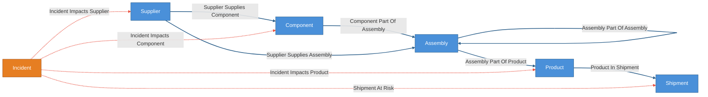
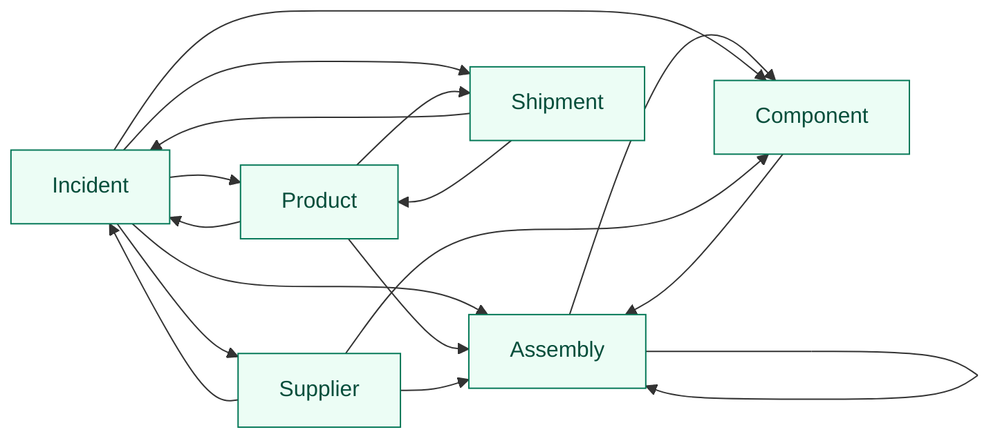

# Supply Chain Blast Radius Demo

Deterministic supply-chain world model that turns a supplier-side disruption into
a bounded, reviewable blast radius. The stable canonical backbone is suppliers,
components, assemblies, products, and shipments. Incidents arrive as governed
trigger state and cascade through staged proposal workflows:

`incident -> supplier -> component/assembly -> product -> at-risk shipment`

Governed edges are rule-centric: proposal bucket signatures carry `rule_id` and
`rule_version`, not `incident_id`, so trust accumulates on reusable cascade rules
across many incidents instead of starting fresh every time.

Everything between `CRUXIBLE:BEGIN` / `CRUXIBLE:END` markers is regenerated
from `config.yaml` by `scripts/render_config_views.py`; treat those blocks as
code-owned structural truth. Everything outside those marker blocks is authored
explanation for humans and agents reading the kit.

## Ontology Map

Entity types and relationships, color-coded by layer. Solid blue lines are
deterministic canonical state. Dashed red lines are governed proposal/review
relationships.

<!-- CRUXIBLE:BEGIN ontology -->

<!-- CRUXIBLE:END ontology -->

**Legend:** Blue = canonical/deterministic state | Orange = governed-only
trigger/judgment entity | Solid blue lines = deterministic | Dashed red lines =
governed proposal/review.

## Workflow Summary

The generated pipeline gives the stage order. The generated stage blocks
underneath keep long context and result lists readable without squeezing them
into a wide table.

```mermaid
flowchart LR
  classDef canonicalWorkflow fill:#4a90d9,stroke:#2c5f8a,color:#fff
  classDef governedWorkflow fill:#e67e22,stroke:#a0521c,color:#fff

  workflow_pipeline_build_seed_state["1. Seed canonical state<br/>Canonical"]
  workflow_pipeline_propose_incident_impacts_supplier["2. Assess supplier impact<br/>Governed proposal"]
  workflow_pipeline_propose_incident_impacts_component["3. Cascade to components<br/>Governed proposal"]
  workflow_pipeline_propose_incident_impacts_product["4. Cascade to products<br/>Governed proposal"]
  workflow_pipeline_propose_shipment_at_risk["5. Flag at-risk shipments<br/>Governed proposal"]
  workflow_pipeline_build_seed_state --> workflow_pipeline_propose_incident_impacts_supplier
  workflow_pipeline_propose_incident_impacts_supplier --> workflow_pipeline_propose_incident_impacts_component
  workflow_pipeline_propose_incident_impacts_component --> workflow_pipeline_propose_incident_impacts_product
  workflow_pipeline_propose_incident_impacts_product --> workflow_pipeline_propose_shipment_at_risk
  class workflow_pipeline_build_seed_state canonicalWorkflow
  class workflow_pipeline_propose_incident_impacts_supplier,workflow_pipeline_propose_incident_impacts_component,workflow_pipeline_propose_incident_impacts_product,workflow_pipeline_propose_shipment_at_risk governedWorkflow
```

<!-- CRUXIBLE:BEGIN workflow-pipeline -->

<!-- CRUXIBLE:END workflow-pipeline -->

<!-- CRUXIBLE:BEGIN workflow-summary -->
### 1. Build Seed State

**Role:** Canonical seed

**Input context**
- None (seeds canonical state)

**Result**
- Canonical entities: Assembly, Component, Product, Shipment, Supplier
- Canonical relationships: Assembly Part Of Assembly, Assembly Part Of Product, Component Part Of Assembly, Product In Shipment, Supplier Supplies Assembly, Supplier Supplies Component

**Provider source**
- Load Supply Chain Seed Data (Python Function, v1.0.0); source: `src/cruxible_core/demo_providers/supply_chain_blast_radius.py::load_seed_data`

### 2. Propose Incident Impacts Supplier

**Role:** Governed proposal

**Input context**
- Entity context: Incident, Supplier

**Result**
- Proposed relationships: Incident Impacts Supplier

**Provider source**
- Assess Incident Supplier Scope (Python Function, v1.0.0); source: `src/cruxible_core/demo_providers/supply_chain_blast_radius.py::assess_incident_supplier_scope`

### 3. Propose Incident Impacts Component

**Role:** Governed proposal

**Input context**
- Entity context: Component
- Relationship context: Incident Impacts Supplier, Supplier Supplies Component

**Result**
- Proposed relationships: Incident Impacts Component

**Provider source**
- Assess Incident Component Cascade (Python Function, v1.0.0); source: `src/cruxible_core/demo_providers/supply_chain_blast_radius.py::assess_incident_component_cascade`

### 4. Propose Incident Impacts Product

**Role:** Governed proposal

**Input context**
- Entity context: Assembly, Product
- Relationship context: Assembly Part Of Assembly, Assembly Part Of Product, Component Part Of Assembly, Incident Impacts Component, Incident Impacts Supplier, Supplier Supplies Assembly

**Result**
- Proposed relationships: Incident Impacts Product

**Provider source**
- Assess Incident Product Cascade (Python Function, v1.0.0); source: `src/cruxible_core/demo_providers/supply_chain_blast_radius.py::assess_incident_product_cascade`

### 5. Propose Shipment At Risk

**Role:** Governed proposal

**Input context**
- Entity context: Incident, Shipment
- Relationship context: Incident Impacts Product, Product In Shipment

**Result**
- Proposed relationships: Shipment At Risk

**Provider source**
- Assess Shipment Risk (Python Function, v1.0.0); source: `src/cruxible_core/demo_providers/supply_chain_blast_radius.py::assess_shipment_risk`
<!-- CRUXIBLE:END workflow-summary -->

## Governed Relationships

This table is generated from existing matching, decision policy, feedback, and
outcome profile config. It distinguishes structural proposal mechanics from the
authored explanation around them.

<!-- CRUXIBLE:BEGIN governance-table -->
| Relationship | Scope | Signals | Auto-resolve Gate | Review Policy | Feedback | Outcomes |
| --- | --- | --- | --- | --- | --- | --- |
| Incident Impacts Component | Incident -> Component | Incident Component Cascade | All Support; prior trust: Trusted Only | Trust-gated auto-resolve | 3 reason codes | Incident Component Resolution |
| Incident Impacts Product | Incident -> Product | Incident Product Cascade | All Support; prior trust: Trusted Only | Require Review: Product Impact Always Review | 3 reason codes | Incident Product Resolution |
| Incident Impacts Supplier | Incident -> Supplier | Incident Supplier Scope Match | All Support; prior trust: Trusted Only | Trust-gated auto-resolve | 3 reason codes | Incident Supplier Resolution |
| Shipment At Risk | Incident -> Shipment | Shipment Risk Assessment | All Support; prior trust: Trusted Only | Require Review: Shipment Risk Always Review | 3 reason codes | Shipment Risk Resolution |
<!-- CRUXIBLE:END governance-table -->

## Query Map

Named queries are graph-native read surfaces. The map intentionally shows only
entity-to-entity affordances; query names and traversal details live in the
catalog below.

<!-- CRUXIBLE:BEGIN query-map -->

<!-- CRUXIBLE:END query-map -->

## Query Catalog

Use the catalog to understand what questions the kit exposes. Composition,
presentation, and operator summaries should happen in the skill or agent
harness, not by turning every useful traversal into a governed relationship.

<!-- CRUXIBLE:BEGIN query-catalog -->
### Assembly

| Query | Returns | Traversal | Purpose |
| --- | --- | --- | --- |
| Assembly Child Assemblies | Assembly | Assembly Part Of Assembly (Incoming) | Starting from an assembly, find direct child assemblies. |
| Assembly Child Components | Component | Component Part Of Assembly (Incoming) | Starting from an assembly, find direct child components. |

### Component

| Query | Returns | Traversal | Purpose |
| --- | --- | --- | --- |
| Component Parent Assemblies | Assembly | Component Part Of Assembly \| Assembly Part Of Assembly (Outgoing, depth=8) | Starting from a component, find direct and higher-level parent assemblies in the BOM hierarchy. |

### Incident

| Query | Returns | Traversal | Purpose |
| --- | --- | --- | --- |
| Incident At Risk Shipments | Shipment | Shipment At Risk (Outgoing) | Starting from an incident, find at-risk in-flight shipments. |
| Incident Impacted Assemblies | Assembly | Incident Impacts Supplier \| Incident Impacts Component (Outgoing) -> Supplier Supplies Assembly \| Component Part Of Assembly \| Assembly Part Of Assembly (Outgoing, depth=8) | Starting from an incident, derive assemblies exposed to accepted supplier or component impacts by walking supplier_supplies_assembly, component_part_of_assembly, and assembly_part_of_assembly. This is a named query/view, not a governed relationship. |
| Incident Impacted Components | Component | Incident Impacts Component (Outgoing) | Starting from an incident, find components judged impacted via the supplier cascade. |
| Incident Impacted Products | Product | Incident Impacts Product (Outgoing) | Starting from an incident, find finished products judged impacted via component and assembly BOM cascade. The bom_depth_bucket edge property lets the skill filter for tier_2 / tier_3_plus. |
| Incident Impacted Suppliers | Supplier | Incident Impacts Supplier (Outgoing) | Starting from an incident, find suppliers judged impacted. |
| Single Source Components For Incident | Component | Incident Impacts Component (Outgoing) | Starting from an incident, find impacted components that have only one active supplier path. Surfaces the "no alternate active supplier" enrichment for the operator summary. |

### Product

| Query | Returns | Traversal | Purpose |
| --- | --- | --- | --- |
| Product Impacting Incidents | Incident | Incident Impacts Product (Incoming) | Starting from a product, find incidents judged to impact it. |
| Product Shipments | Shipment | Product In Shipment (Outgoing) | Starting from a product, find shipments containing it. |
| Product Top Level Assemblies | Assembly | Assembly Part Of Product (Incoming) | Starting from a product, find top-level assemblies in its BOM. |

### Shipment

| Query | Returns | Traversal | Purpose |
| --- | --- | --- | --- |
| Shipment Products | Product | Product In Shipment (Incoming) | Starting from a shipment, find products contained in it. |
| Shipment Risk Incidents | Incident | Shipment At Risk (Incoming) | Starting from a shipment, find incidents judged to put it at risk. |

### Supplier

| Query | Returns | Traversal | Purpose |
| --- | --- | --- | --- |
| Supplier Impacting Incidents | Incident | Incident Impacts Supplier (Incoming) | Starting from a supplier, find incidents judged to impact it. |
| Supplier Supplied Assemblies | Assembly | Supplier Supplies Assembly (Outgoing) | Starting from a supplier, find directly supplied assemblies. |
| Supplier Supplied Components | Component | Supplier Supplies Component (Outgoing) | Starting from a supplier, find directly supplied components. |
<!-- CRUXIBLE:END query-catalog -->

## Model Notes

- `Assembly` is a canonical entity because the domain needs hierarchical BOM
  structure, not just a loose component-to-product shortcut.
- `component_part_of_assembly`, `assembly_part_of_assembly`, and
  `assembly_part_of_product` preserve the product structure needed for
  downstream blast-radius and tier-depth analysis.
- `incident_impacted_assemblies` is a named query/view, not governed state. It is
  derived from accepted supplier/component impact plus the deterministic BOM.
- `product_in_shipment` points from `Product` to `Shipment`, so shipment risk is
  downstream from the product-impact decision.
- Product impact and shipment risk are governed and review-gated because they
  drive customer-facing action.

## Debug Views

Detailed mechanical Mermaid renderings are still available when needed:

```bash
uv run python scripts/render_config_views.py demos/supply-chain-blast-radius/config.yaml --view workflow-steps
uv run python scripts/render_config_views.py demos/supply-chain-blast-radius/config.yaml --view queries
```

## Quality Checks

- `components_have_supplier`: every component should have at least one supplier.
- `critical_components_have_redundancy`: critical components should have at least
  two active suppliers.
- `components_have_kind`: components should declare whether they are raw material
  or part.
- `products_have_assembly_bom`: every product should have at least one top-level
  assembly in its BOM.

## Maintenance

Regenerate the structural sections after changing ontology, workflows, governed
relationships, or named queries:

```bash
uv run python scripts/render_config_views.py demos/supply-chain-blast-radius/config.yaml --update-readme demos/supply-chain-blast-radius/README.md
```

To inspect the same generated bundle without editing the README:

```bash
uv run python scripts/render_config_views.py demos/supply-chain-blast-radius/config.yaml --view all
```

## Status

This is a scaffold: the config, workflows, named queries, feedback profiles,
outcome profiles, and decision policies are in place. The seed CSV bundle and
five providers (`load_supply_chain_seed_data` plus the four cascade assessors)
land in a follow-up.

Until then, `cruxible validate` reports the known seed artifact gap on
`build_seed_state`: the canonical provider `load_supply_chain_seed_data` needs an
artifact bundle with `sha256`. The rest of the config structure is available for
review and diagram generation.
